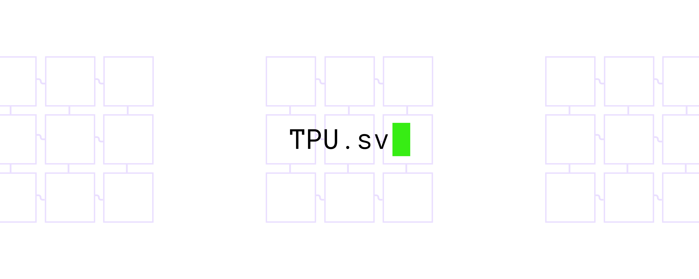

<picture>
  <source
    srcset="docs/tpu_sv_darkbanner.png"
    media="(prefers-color-scheme: dark)"
  />
  <source
    srcset="docs/tpu_sv_lightbanner.png"
    media="(prefers-color-scheme: light), (prefers-color-scheme: no-preference)"
  />
  
</picture>

TPU.sv is a reconstruction of Google's TPU (v1) in SystemVerilog. The primary objective of this project is to develop a generic and resource-adjustable machine learning inference accelerator for educational purposes.

  

## Project Structure

- `docs` - Project documentation and images
- `src/tpu/lib` - Libraries for common parameters, functions, tasks, etc.
- `src/tpu/rtl` - RTL description of TPU.sv
- `src/tpu/sim` - Testbenches

## Architectural Overview

<picture>
  <source
    srcset="docs/architectural_overview_dark.svg"
    media="(prefers-color-scheme: dark)"
  />
  <source
    srcset="docs/architectural_overview_light.svg"
    media="(prefers-color-scheme: light), (prefers-color-scheme: no-preference)"
  />
  
</picture>

## Credits

The following sources have been primarily referenced for this project:

- [Google's 2018 paper introducing TPU's architecture](https://arxiv.org/abs/1704.04760)
- ["Implementierung einer Tensor Processing Unit" by Jonas Fuhrmann](https://reposit.haw-hamburg.de/handle/20.500.12738/8527)
- [tinyTPU by Jonas Fuhrmann](https://github.com/jofrfu/tinyTPU/)

## Status

The core has been completed and successfully passes simulations as of 2024-10-12. An AXI wrapper is also implemented and tested as of 2025-06-10.

### Next Steps

- Evaluation on real hardware with actual machine learning workloads
- Refinement of the hardware description
- Enhancement of the documentation

## Contributing

Contributions of any kind are welcome. If you encounter a bug, please do not hesitate to create an issue.

## License

TPU.sv is licensed under the MIT License. See [LICENSE](LICENSE) for details.

---